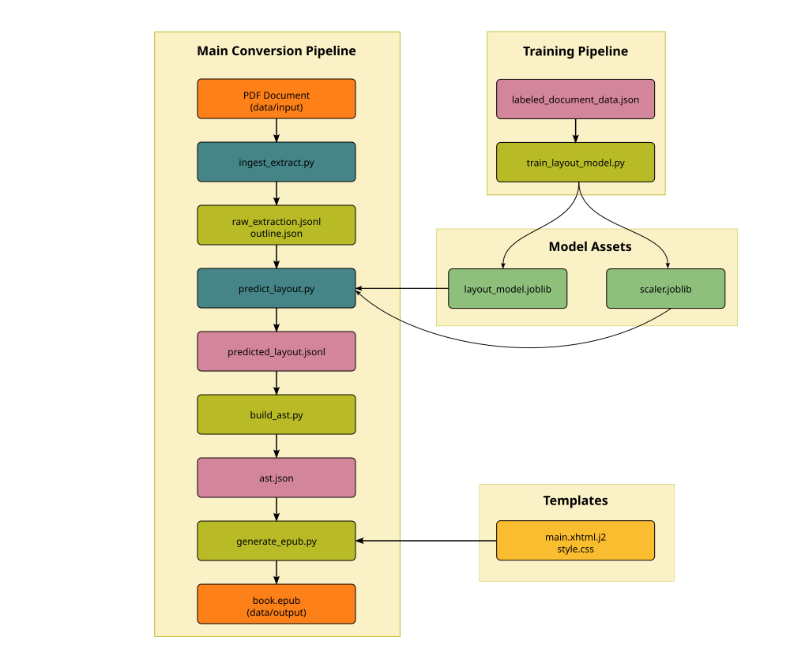

# PDF to EPUB Converter

This project is a pipeline for converting PDF documents into structured EPUB files. It uses PyMuPDF for raw content extraction, a machine learning model (RandomForest) to classify document elements, and the `ebooklib` library to assemble the final EPUB.

<p align="center">
  
</p>

---

## Pipeline Overview

The pipeline consists of four main stages, as illustrated above:

**1. Ingestion & Raw Extraction**  
`src/ingest_extract.py`
- Extracts text, fonts, bounding boxes, images, and the PDF outline from the PDF using PyMuPDF.
- Saves images to `data/output/`.
- Outputs: `raw_extraction.jsonl`, `outline.json`

**2. Layout Prediction**  
`src/predict_layout.py`
- Uses a pre-trained RandomForest model to classify each text block (e.g., "paragraph", "heading").
- The model is trained on labeled data via `train_layout_model.py` (optional, for retraining).
- Outputs: `predicted_layout.jsonl`

**3. AST Construction**  
`src/build_ast.py`
- Organizes the classified elements and outline into a structured hierarchy (Abstract Syntax Tree).
- Merges consecutive paragraphs and handles different element types.
- Outputs: `ast.json`

**4. EPUB Generation**  
`src/generate_epub.py`
- Uses Jinja2 templates to convert the AST into XHTML content.
- Packages the XHTML, images, and CSS into a final EPUB file using `ebooklib`.
- Outputs: `book.epub` in `data/output/`

---

## How to Run

### 1. Installation

Set up a virtual environment and install the required dependencies:

```bash
python -m venv .venv
source .venv/bin/activate
pip install -r requirements.txt
```

### 2. Place Your PDF

Put the PDF file you want to convert into the `data/input/` directory. You will need to update the `PDF_PATH` variable in `src/config.py` to point to your file.

### 3. Run the Full Pipeline

You can run the entire pipeline by executing the scripts in order:

```bash
python src/ingest_extract.py
python src/predict_layout.py
python src/build_ast.py
python src/generate_epub.py
```

The final `book.epub` will be located in the `data/output/` directory.

---

## Project Structure

```
data/:
src/:
   config.py
   features.py
   ingest_extract.py
   train_layout_model.py
   predict_layout.py
   build_ast.py
   generate_epub.py
templates/
requirements.txt

```